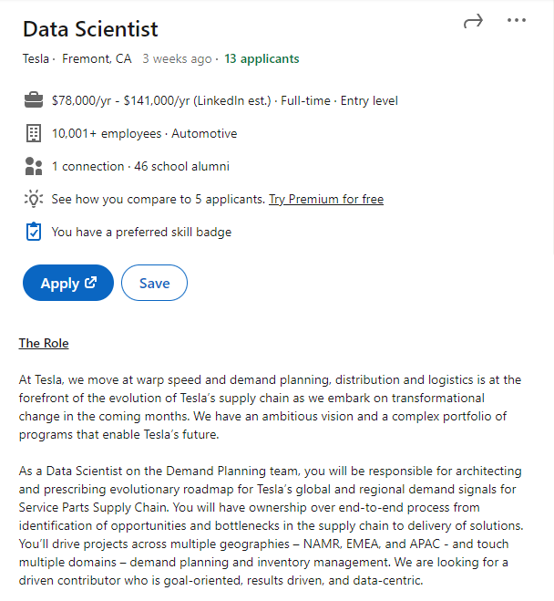
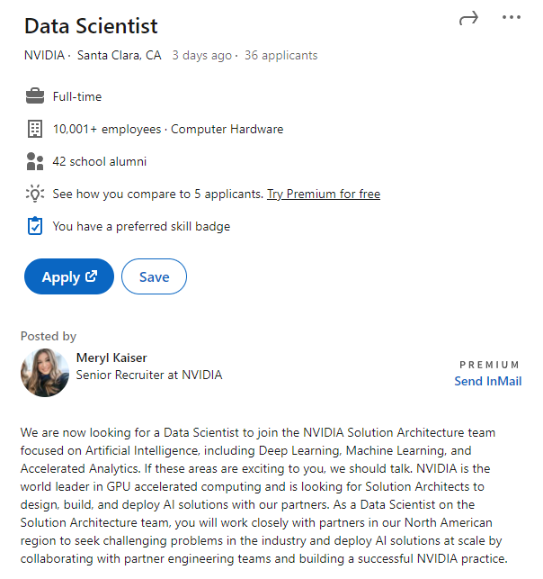
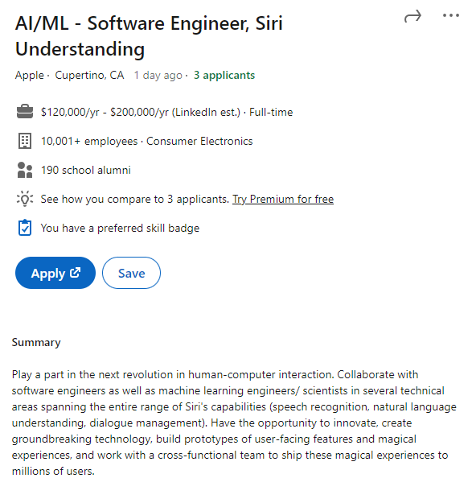

Sung Jun Lee - 260915225

COMP 598 - A10

# Task 1: Data Science Careers

For my jobs I chose:

1. 
2. 
3. 

The reasons I chose these careers are simple. They are all innovative companies who work with a mission to make the world a better place. And, their companies interests lie at the intersection of mine. Personally, the two biggest fields that I am interested in are Machine Learning / Artificial Intelligence as well as Electric Vehicles. I believe, if I could work for these companies, that I would be able to thrive, maximize my potential, and work happily knowing that I am using my skills to contribute to something that will affect the world in a positive way.

# Task 2: Highs and Lows

NA
