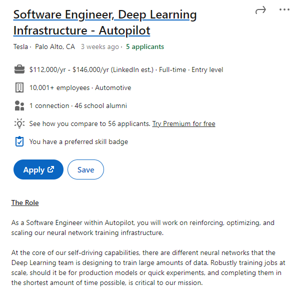

Sung Jun Lee - 260915225

COMP 598 - A10

# Task 1: Data Science Careers

For my jobs I chose:

1. 
2. 
3. 

The reasons I chose these careers are simple. They are all located near Silicon Valley, CA, the world's heart of technology. And they are all innovative companies who work with a mission to make the world a better place. And, their company interests lie at the intersection of mine. 
Personally, the two biggest fields that I am interested in are Machine Learning / Artificial Intelligence as well as Electric Vehicles. I believe, if I could work for these companies, that I would be able to thrive, maximize my potential, and work happily knowing that I am using my skills to contribute to something that will affect the world in a positive way. 
Data Science - everything from preprocessing to analytics and results - is very important for ML/AI. Data Science and Machine Learning go hand in hand.
Working at Tesla, the leading EV company, as a Deep Learning Software Engineer for their Autopilot would entail working with a lot of data, which as I learned throughout the course is something I do not mind and can even be a very fun and rewarding job. 
NVIDIA is also an industry leader in AI/ML and a lot of their hardware and software is used by other companies such as Tesla. Working at NVIDIA would allow me to use the ML theory I learned at McGill as well as put into practice the data science skills I learned in COMP 598. 
Lastly at Apple as an AI/ML SWE working for the Siri division, it would require me to use my data science skills combined with my NLP skills that I learned from COMP 550 to help improve Siri, which many people use on a daily basis. 
While there may be other reasons to seek a data science job such as salary, benefits, etc., the main reason for data science, in my opinion, is its versatility and practicality when used in tandem with other fields such as AI/ML. Plus, the California weather doesn't seem too bad either!

# Task 2: Highs and Lows

NA
